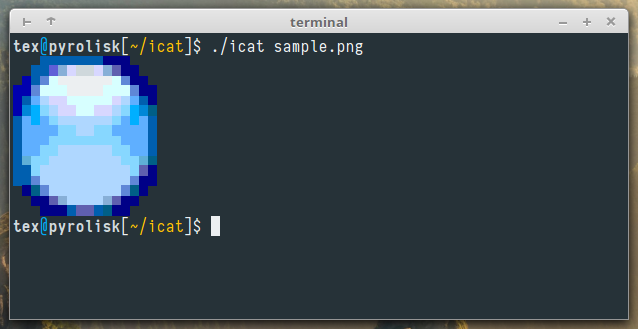

icat - image cat
================
Outputs an image on a 256-color or 24-bit color enabled terminal with UTF-8 locale,
such as gnome-terminal, konsole or rxvt-unicode (urxvt).

Building
--------

Build requirements: icat depends on imlib2.

On Ubuntu, `apt-get install libimlib2-dev`

On Darwin (Mac OS X), `brew install imlib2`

Note that for Darwin (Mac OS X), you will need to install [XQuartz](http://xquartz.macosforge.org/landing/) first, the version of the X.Org X Window System (X11) that runs on OS X.

To compile:

	make

Running
-------

Run icat with a local file:

	icat sample.png

or with multiple files:

	icat img1.jpg img2.jpg > newfile.txt

or, if `-` is used as as file name, it reads from standard input:

	curl -sL https://raw.github.com/atextor/icat/master/sample.png | icat -

The above commands results the following output in 256-color terminal, see [`sample.256-color.txt`](sample.256-color.txt) for the actual output:

For terminals that support 24-bit color (such as Konsole and Yakuake, see [this document](https://gist.github.com/XVilka/8346728) for more information about terminals and their color support), this can be enabled using:

	icat -m 24bit sample.png

Author
------

icat was written by Andreas Textor <textor.andreas@googlemail.com>.
The sample icon is from the Nuvola icon theme by David Vignoni.

